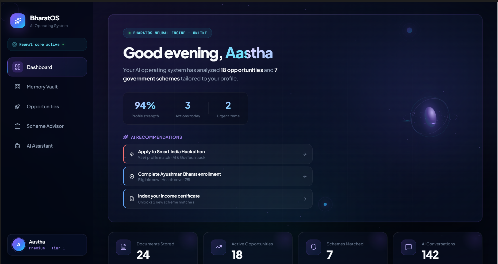
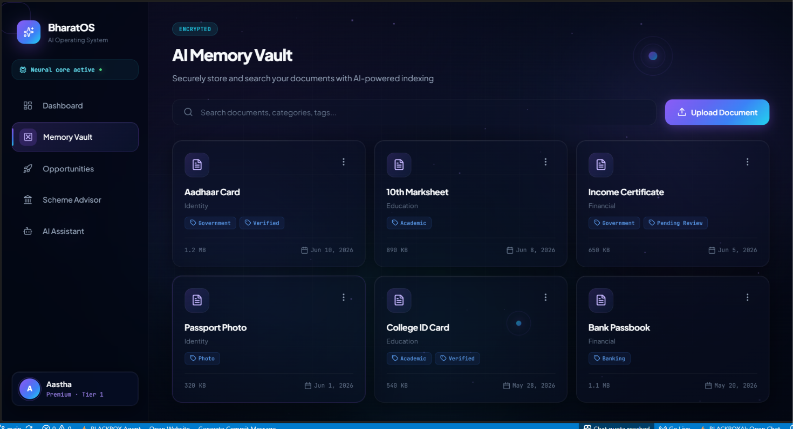
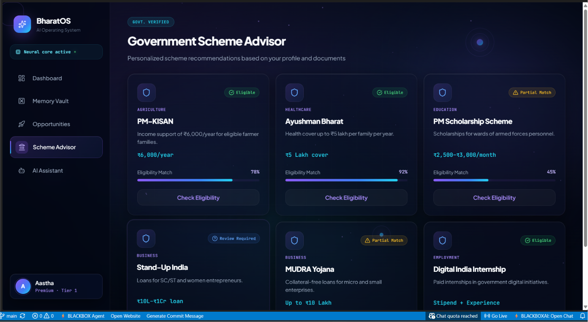

# BharatOS AI 🇮🇳

### One AI. One Identity. One Future.

An AI-powered Life Operating System that helps students and citizens discover opportunities, access government schemes, manage important documents, and receive personalized guidance through a unified platform.

---
## Platform Preview

<p align="center">
  
</p>


## Problem Statement

Today, users interact with multiple disconnected systems for:

* Government schemes
* Scholarships
* Internships
* Hackathons
* Educational opportunities
* Personal document management

As a result:

* Opportunities are missed
* Benefits remain unclaimed
* Information is fragmented
* Users lack personalized guidance

Existing platforms provide information, but very few actively help users take action.

---

## Our Solution

BharatOS AI acts as an intelligent digital operating system that connects opportunities, government services, documents, and AI recommendations into one ecosystem.

The platform enables users to:

* Store and manage important documents
* Discover relevant scholarships and internships
* Identify government schemes they qualify for
* Receive AI-powered recommendations
* Track opportunities from a single dashboard

---

## Key Features

### Dashboard

Centralized overview of:

* Opportunities
* Government schemes
* AI insights
* Reminders
* User activity

### Memory Vault

Digital repository for:

* Aadhaar Card
* PAN Card
* Income Certificate
* Academic Records
* Certificates

### Opportunity Engine

Personalized discovery of:

* Scholarships
* Internships
* Hackathons
* Career opportunities

### Government Scheme Advisor

Provides:

* Eligibility analysis
* Benefit details
* Required documentation
* Recommendation scores

### BharatOS AI Assistant

AI-powered assistant that helps users:

* Find opportunities
* Understand eligibility
* Navigate schemes
* Make informed decisions

---
## Additional Screenshots

### Memory Vault



### Government Scheme Advisor




## System Architecture

```text
                    User
                      │
                      ▼

              BharatOS AI Platform
                      │
                      ▼

            AI Recommendation Engine
                      │

      ┌──────────┬──────────┬──────────┐
      ▼          ▼          ▼

 Memory Vault  Opportunities  Schemes

      └──────────┴──────────┴──────────┘
                      │
                      ▼

              BharatOS AI Assistant
                      │
                      ▼

         Personalized Recommendations
```

---

## Technology Stack

### Frontend

* React.js
* Vite
* JavaScript
* CSS3

### UI & Animations

* Framer Motion
* Lucide React

### Development

* Git
* GitHub
* VS Code

---

## Installation

```bash
git clone https://github.com/AasthaSingh15/Bharat-OS.git

cd Bharat-OS

npm install

npm run dev
```

---

## Scalability

### Phase 1

Student ecosystem:

* Scholarships
* Internships
* Hackathons

### Phase 2

Citizen services:

* Government schemes
* Welfare programs
* Benefit discovery

### Phase 3

National integrations:

* DigiLocker
* Aadhaar verification
* Employment services

### Phase 4

AI Life Operating System:

* Predictive recommendations
* Personalized planning
* Intelligent citizen assistance

---

## Expected Impact

* Increased access to opportunities
* Better utilization of government benefits
* Simplified document management
* Reduced information fragmentation
* Personalized AI guidance

---

## Future Roadmap

* DigiLocker Integration
* Mobile Application
* Voice Assistant
* Multilingual Support
* AI Resume Analysis
* Predictive Opportunity Engine

---

## Team

Project: BharatOS AI

Team Members:

- Aastha Singh

Developed for Innovation & Ideathon 2026.
